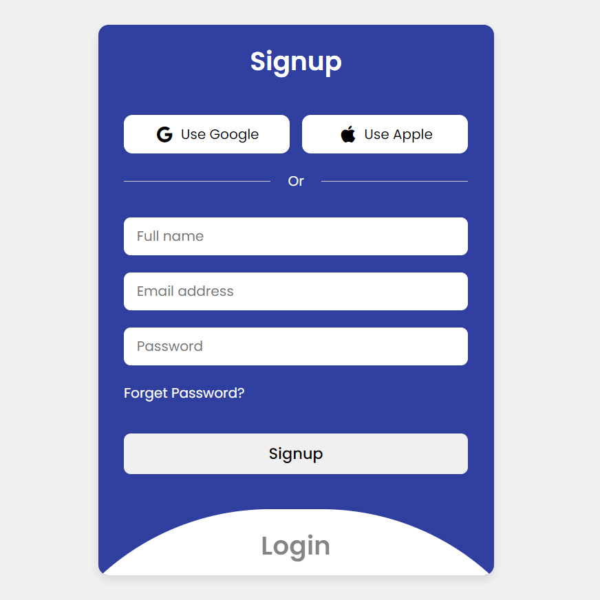

# animated-login
<h1>
Animated Login Design 
</h1>
<h3>
In this tutorial, I'll show you how to use modern HTML, CSS, and JavaScript. We use CSS Flexbox, CSS transition for some amazing animation effects!
</h3>
